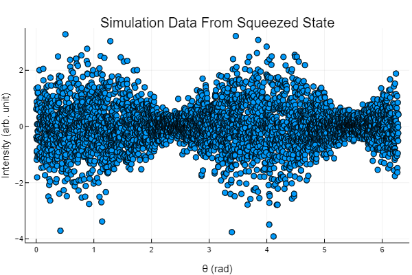
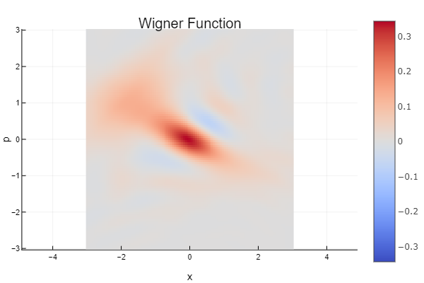

```@meta
CurrentModule = QuantumStateDistributions
```

# QuantumStateDistributions

Documentation for [QuantumStateDistributions](https://github.com/foldfelis-QO/QuantumStateDistributions.jl).

## Installation

The package can be installed with the Julia package manager.
From the Julia REPL, type `]` to enter the Pkg REPL mode and run:

```julia-repl
pkg> add QuantumStateDistributions
```

## Quick start

Construct a squeezed state via
[`QuantumStateBase.jl`](https://github.com/foldfelis-QO/QuantumStateBase.jl)
and declare its quantum state distribution.

```julia-repl
julia> using QuantumStateDistributions, QuantumStateBase

julia> r, θ, dim = 0.8, π/2, 100;

julia> ρ = SqueezedState(r, θ, Matrix, dim=dim)
100×100 Matrix{ComplexF64}:
       0.7477+0.0im          0.0+0.0im  …  -1.77607e-24-5.91946e-10im  0.0+0.0im
          0.0+0.0im          0.0+0.0im              0.0+0.0im          0.0+0.0im
 -2.14974e-17+0.351079im     0.0+0.0im      2.77945e-10-8.16923e-25im  0.0+0.0im
          0.0+0.0im          0.0+0.0im              0.0+0.0im          0.0+0.0im
             ⋮                          ⋱
          0.0+0.0im          0.0+0.0im              0.0+0.0im          0.0+0.0im
 -1.77607e-24+5.91946e-10im  0.0+0.0im      4.68637e-19+0.0im          0.0+0.0im
          0.0+0.0im          0.0+0.0im              0.0+0.0im          0.0+0.0im

julia> d = GaussianStateBHD(ρ);
```

Sample a point from the quantum state distribution
in intensity-to-measurement-phase quadrature coordinate
measured by balanced homodyne detection:

```julia-repl
julia> rand(d)
2-element Vector{Float64}:
 0.8420476666965236
 1.6008878775912423
```

Sample `n` points from the quantum state distribution:

```julia-repl
julia> rand(d, 4096)
2×4096 Matrix{Float64}:
  0.0018714   0.0034182   0.00403972  0.00780472  …   6.27393  6.27811    6.27884
 -0.706334   -1.16179    -0.195581    0.174201       -0.60763  0.853457  -0.217017
```



## Estemate density matrix of a quantum state via MLE

Generate some data from a squeezed state:

```julia-repl
julia> data = rand(d, 81920);
```

Construct a `PositivePreservingIterator`:

```julia-repl
julia> t = 50;

julia> ppit = PositivePreservingIterator(data, t, dim=35);
```

Estermate density matrix:

```julia-repl
julia> run!(ppit)

julia> ρ_mle = ppit.ρ
```



## Index

```@index
```

## APIs

```@autodocs
Modules = [QuantumStateDistributions]
```
